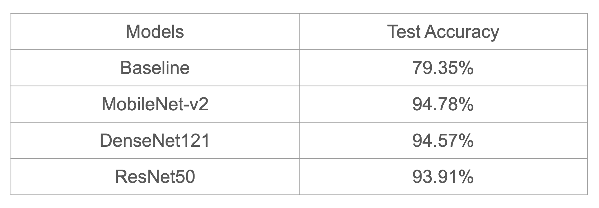
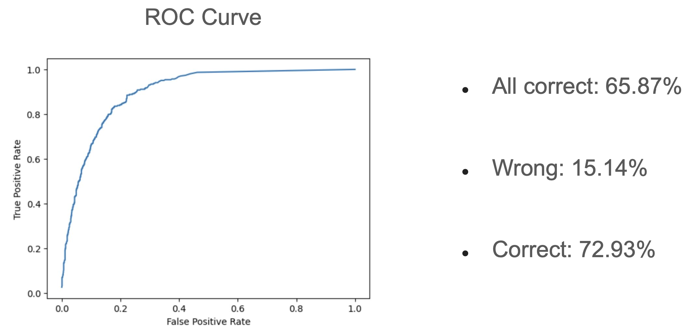

# (Computer Vision 05/2024) Car Damage Detection and Classification

  

## Motivation and Goal
The **need for accurate vehicle damage assessment in the fleet management and insurance industries** drives our project. Leveraging our team’s expertise in data science and machine learning, we aim to **develop robust models** using curated datasets from platforms like Kaggle.

## Innovation
Our approach is innovative in several ways:
* Move beyond binary classification to include multiple classification tasks, categorizing damages into frontal, side, and rear categories for deeper insights. 
* Integrate deep learning models such as **DenseNet121, MobileNet-v2, ResNet-50, and CLIP** to improve classification accuracy and generalization.
* **Advanced preprocessing techniques** are employed to optimize model performance and avoid overfitting.

## Approaches
### Binary classification (distinguishes between nondamaged and damaged cars)

  

For the binary classification task:
* Compare the performance of DenseNet121, MobileNet-v2, ResNet-50, and CLIP against a baseline model.
* Conduct rigorous evaluations and metrics comparisons to assess the models’ effectiveness in accurately classifying vehicle damages.

### Multiple classification (identifies the type and location of damages (front, side, rear))

  

For the multiple classification task:
* Utilize ResNet-50 and CLIP models to categorize damages into different classes.
* Manually relabel datasets to ensure high-quality training data for multiclass classification, emphasizing the importance of data relevance and accuracy in our methodologies.
